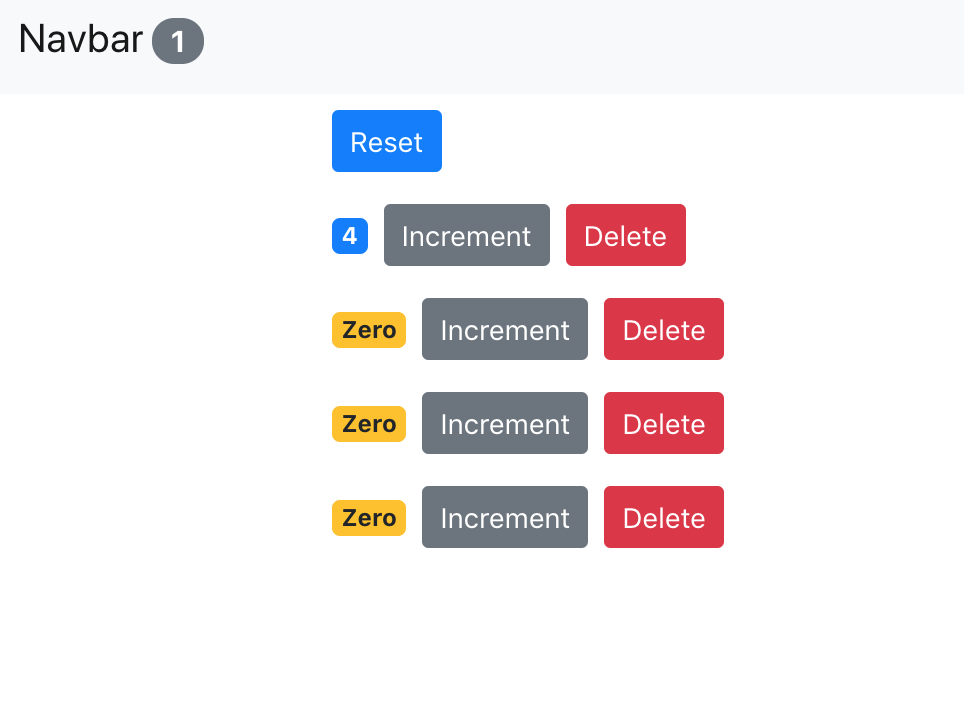

# Counter App

An app made in React in which you can increment the value by pressing a button and delete a counter in the same fashion. This was done so that I can gain an understanding of React and understanding it's structure.

# Installation

Clone this repo, then:

``` npm start ```



